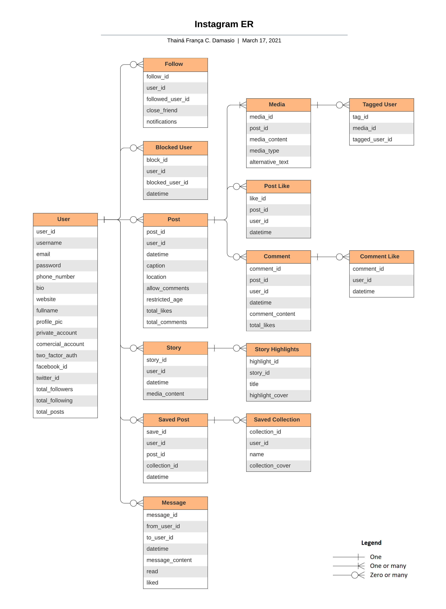

1. Suppose you're working with 3 people on a project. What would be **the** ideal software development process?

To develop a team project, the ideal process is an agile methodology, such as Scrum, Extreme Programming(XP), Kanban or others. The cyclical development process and team interaction will make it easier for developers to work on different features or different parts of a feature at the same time and support each other when needed.

Based on agile manifesto and its principles, developers must work together daily and talk face-to-face, the team should reflect on how the process is working and what needs to be adjusted at regular intervals, so that with these and other practices, agile processes guarantee greater productivity and customer satisfaction.

#### References
- [Manifesto for Agile Software Development](https://agilemanifesto.org/iso/en/manifesto.html)
- [Principles behind the Agile Manifesto](https://agilemanifesto.org/iso/en/principles.html)

 

2. How do you think an entity relationship diagram for _Instagram_ would be like?

The diagram above was designed using [Lucidchart](http://lucidchart.com/) and the original document can be found [here](https://lucid.app/documents/view/220ba433-6904-49f6-a50a-ad59814dd3bb).

#### References
- [Modelo Entidade Relacionamento (MER) e Diagrama Entidade-Relacionamento (DER)](https://www.devmedia.com.br/modelo-entidade-relacionamento-mer-e-diagrama-entidade-relacionamento-der/14332)

 

3. Now that you have imagined the ER diagram, **how** would you build _Instagram_ from scratch?

#### Plan and Design

- Analyze requirements and data flow
- Determine the target platform and hardware
- Determine the technologies, frameworks and methodologies to be used
- Select development team
- Design software macro architecture
- Design detailed frontend and backend architectures
- Pricing necessary infrastructure and tools
- Prototype frontend screens

#### Develop and Test

- Backend
  - Implement database structure
  - Develop database business rules
  - Develop the API
  - Perform unit tests
  - Refactor the code

- Frontend
  - Develop the application
  - Perform unit tests
  - Refactor the code

- Perform integration tests

#### Deploy and Maintain

- Deploy the application to the target platforms
- Correct bugs found by the user
- Develop and implement new features